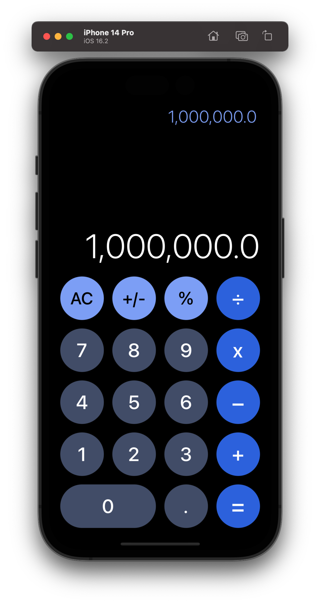
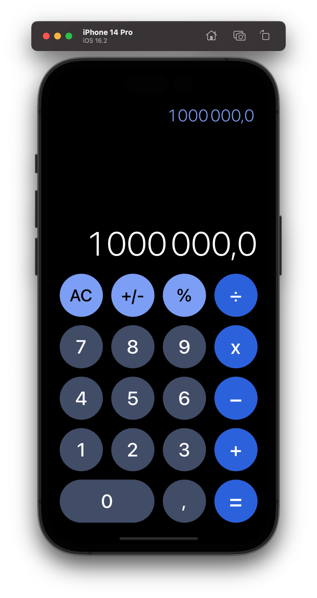
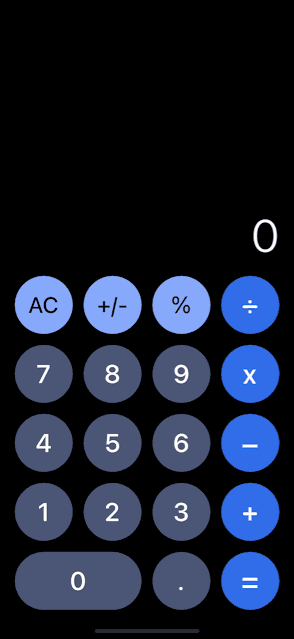
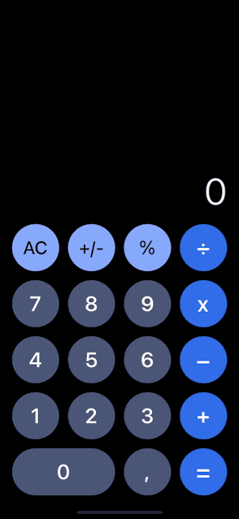
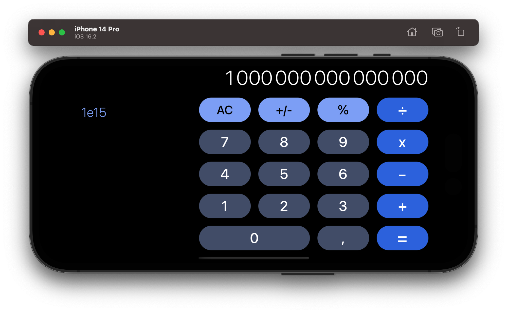

#  iOS Calculator 

An elegant calculator app for iOS, inspired by Apple's official design.

|United States|France|
|--|--|
|||

## Requirements

* iOS 16+

## Features

* Responsive Layout from the iPhone SE (3rd Generation) to the last version.
* Supports both portrait and landscape modes.
* Decimal separator and display based on national writing conventions.
* Adaptive output based on screen orientation and number length:
    * Font automatically adjusts when the limit is reached, and a minus sign is added.
    * Numbers exceeding the limit are converted into scientific notation.
* Buttons' behavior mirroring that of the official Apple app:
	* Rounded buttons and a Gray/Blue color palette.
    * Animation effects corresponding to the touch event type.
* Digit removal from added number by swiping right or left.
* Automatic scrolling to the last line when history becomes lengthy.
* Double-tapping the AC button also clears the history.

## Technologies Used

* UX/UI: UIKit, via storyboard and code.

## Usage

This app works like the official Apple iOS Calculator, supporting basic arithmetic.
It also has a history of past expressions, which can be cleaned by double tapping on the AC button.

## Installation

1. Clone or download the repository.
2. Open the project in Xcode.

## Architecture

* MVC Architecture.

## Demo

|United States|France|
|--|--|
|||

|United States|France|
|--|--|
|||

## License

See [LICENSE.md](LICENSE.md) for details
